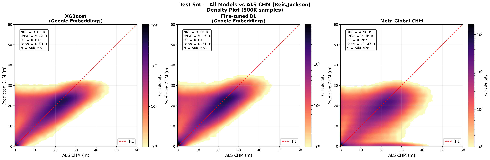
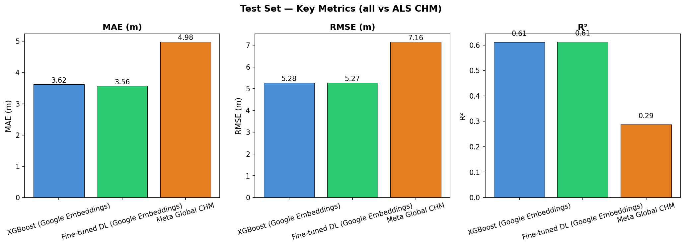

# Canopy Height Model Comparison — Tocantins, Brazil

**Benchmarking satellite-derived canopy height models against airborne LiDAR in the Brazilian Amazon — comparing Meta's Global CHM, XGBoost, and a fine-tuned MLP using Google AlphaEarth embeddings across 487 ALS transects.**


---

## Highlights

- **29% improvement** over Meta's global product: embedding-based models reduce MAE from 4.98 m to ~3.6 m
- **XGBoost matches deep learning**: a simple gradient-boosted tree performs on par with a 4-layer residual MLP (R² = 0.612 vs 0.613)
- **Spatial cross-validation** by transect prevents data leakage — all metrics are on spatially independent test sets
- **487 ALS transects** from the EBA campaign provide dense, high-quality ground truth across diverse forest types
- **Google AlphaEarth embeddings** (64-dim, 30 m) serve as a powerful, off-the-shelf feature representation for vegetation structure

---

## Problem Statement

Accurate canopy height maps are essential for carbon stock estimation, biodiversity monitoring, and forest management. Global satellite-derived products like [Meta's Canopy Height Map](https://sustainability.fb.com/blog/2023/04/18/every-tree-counts-large-scale-mapping-of-canopy-height-at-the-resolution-of-individual-trees/) provide wall-to-wall coverage but may underperform locally. This project asks: **can we improve on global products by fine-tuning models with local airborne LiDAR data and modern satellite embeddings?**

---

## Study Area

The study area covers ~46 km² in northern Tocantins state, Brazil, at the transition between the Cerrado biome and the Amazon rainforest. This ecotone provides a challenging test case with canopy heights ranging from open savanna (0–5 m) to tall closed-canopy forest (>30 m).

**Coordinates**: ~47.2°W, 7.5°S

---

## Data Sources

| Dataset | Source | Resolution | Role |
|---------|--------|-----------|------|
| ALS CHM | [Reis & Jackson (2022), Zenodo](https://zenodo.org/records/7104044) | 1 m | Ground truth (487 transects, EBA campaign 2016–2018) |
| Google AlphaEarth Embeddings | [GEE](https://developers.google.com/earth-engine/datasets/catalog/GOOGLE_SATELLITE_EMBEDDING_V1_ANNUAL) | 30 m (64 bands) | Input features for ML models |
| Meta Global Canopy Height | [GEE Community Catalog](https://gee-community-catalog.org/projects/meta_trees/) | 1 m | Baseline comparison product |
| GEDI L2A | GEE (`LARSE/GEDI/GEDI02_A_002_MONTHLY`) | 25 m footprint | Independent spaceborne LiDAR validation |
| Sentinel-2 RGB | GEE | 10 m | Visual context |

---

## Methodology

```
ALS CHM (1m)  ──→  Resample to 30m  ──→  Pair with Google Embeddings (64-dim)
                                              │
                                              ├──→  XGBoost (spatial split 70/15/15)
                                              │         └──→  Predict CHM
                                              │
                                              └──→  MLP with residual blocks (same split)
                                                        └──→  Predict CHM

Meta Global CHM  ──→  Sample at same locations  ──→  Compare all three vs ALS ground truth
```

### Three approaches compared

1. **Meta Global Canopy Height Map** — off-the-shelf global product (1 m native, sampled at evaluation points). No local training.

2. **XGBoost** — Gradient-boosted trees trained on 64-dim Google AlphaEarth satellite embeddings at 30 m. Spatial train/val/test split by transect (70/15/15). Hyperparameters: 500 trees, depth 6, learning rate 0.05, early stopping on validation RMSE.

3. **Fine-tuned MLP** — 4-layer residual MLP (256-dim hidden, LayerNorm, GELU, dropout 0.1) trained on the same embeddings and split. Cosine annealing LR schedule, early stopping with patience 15.

### Spatial cross-validation

All splits are by **transect** (entire ALS flight lines stay together) to prevent spatial autocorrelation from inflating metrics. For the 1 km validation grid, 10-fold spatial CV ensures every transect is predicted by a model that never saw it during training.

---

## Results

### Test set metrics (30 m, spatial split)

| Model | MAE (m) | RMSE (m) | R² | Bias (m) |
|-------|---------|----------|-----|----------|
| Meta Global CHM | 4.98 | 7.16 | 0.287 | -1.47 |
| XGBoost | 3.62 | 5.28 | 0.612 | +0.01 |
| Fine-tuned MLP | 3.56 | 5.27 | 0.613 | +0.31 |





---

## Key Findings

1. **Google AlphaEarth embeddings are highly effective** for canopy height prediction — a simple XGBoost on 64 embedding bands achieves R² = 0.61, far exceeding Meta's global product (R² = 0.29) in this region.

2. **Deep learning offers marginal gains over XGBoost** — the MLP reduces MAE by only 0.06 m (3.62 → 3.56 m). The embeddings already capture most of the learnable signal; architectural complexity adds little.

3. **Meta's product systematically underestimates tall canopy** — the -1.47 m bias and low R² suggest the global model struggles in this cerrado-Amazon transition zone, likely due to the structural heterogeneity of the landscape.

4. **Local fine-tuning with ~300 transects is sufficient** to substantially outperform a global product, especially when paired with modern foundation-model embeddings.

---

## Reproducibility

### Prerequisites

- Python 3.10+
- Google Earth Engine account (authenticated via `earthengine authenticate`)
- ~50 GB disk space for full ALS dataset

### Quick start

```bash
# Clone and install
git clone https://github.com/YOUR_USERNAME/canopy-height-comparison-tocantins.git
cd canopy-height-comparison-tocantins
pip install -r requirements.txt

# Set your GEE project
export GEE_PROJECT="your-gee-project-id"

# Run the full pipeline
make all

# Or step by step:
make download            # Download ALS CHM from Zenodo
make extract-embeddings  # Extract Google embeddings (requires GEE)
make build-grid          # Build 1km validation grid
make train-xgboost       # Train XGBoost baseline
make train-mlp           # Train fine-tuned MLP
make compare             # Three-way comparison + wall-to-wall maps
make visualize           # Interactive 3-panel map
```

### Run tests

```bash
make test
# or
python -m pytest tests/ -v
```

---

## Project Structure

```
canopy-height-comparison-tocantins/
├── README.md
├── LICENSE                          (MIT)
├── .gitignore
├── requirements.txt
├── Makefile
├── AOI.geojson                      Study area boundary
├── figures/                         Output visualizations
│   ├── three_way_comparison.png     Scatter plots (hero figure)
│   ├── three_way_metrics_bars.png   Bar chart comparison
│   ├── three_way_rasters.png        Wall-to-wall predictions
│   ├── xgboost_results.png          XGBoost train/val/test
│   └── prithvi_results.png          MLP train/val/test
├── notebooks/
│   ├── 01_data_acquisition.ipynb    Download Meta CHM + GEDI from GEE
│   ├── 02_feature_extraction.ipynb  Google AlphaEarth embeddings pipeline
│   └── 03_model_comparison.ipynb    Results analysis + figures
├── src/
│   ├── __init__.py
│   ├── config.py                    Centralized constants and paths
│   ├── data_processing/
│   │   ├── download_chm.py          Download ALS CHM from Zenodo
│   │   ├── gee_utils.py             GEE access (GEDI, Meta CHM)
│   │   ├── extract_embeddings.py    Google embeddings extraction
│   │   ├── build_validation_grid.py 1km grid construction
│   │   ├── run_all_footprints.py    Process all 487 transects
│   │   ├── add_finetuned_column.py  K-fold predictions at 1km
│   │   ├── build_30m_table.py       Multi-resolution validation table
│   │   └── build_3panel_map.py      Interactive Leaflet map
│   └── models/
│       ├── xgboost_baseline.py      XGBoost on embeddings
│       ├── mlp_finetune.py          Residual MLP on embeddings
│       └── compare_models.py        Three-way comparison + rasters
├── tests/
│   ├── test_validation_grid.py      Grid snapping logic
│   └── test_evaluate.py             Metrics computation
└── data/
    └── sample/                      Small committed samples
        └── three_way_comparison.csv Metrics summary table
```

---

## References

- **Reis, C. R. & Jackson, T. D.** (2022). Canopy Height Models from the EBA Project. Zenodo. [doi:10.5281/zenodo.7104044](https://zenodo.org/records/7104044)
- **Tolan, J. et al.** (2024). Very high resolution canopy height maps from RGB imagery using self-supervised vision transformer and convolutional decoder trained on aerial lidar. *Remote Sensing of Environment*, 300, 113888. (Meta Global Canopy Height)
- **Google AlphaEarth Satellite Embeddings** — [Earth Engine Data Catalog](https://developers.google.com/earth-engine/datasets/catalog/GOOGLE_SATELLITE_EMBEDDING_V1_ANNUAL)

---

## License

MIT — see [LICENSE](LICENSE).
